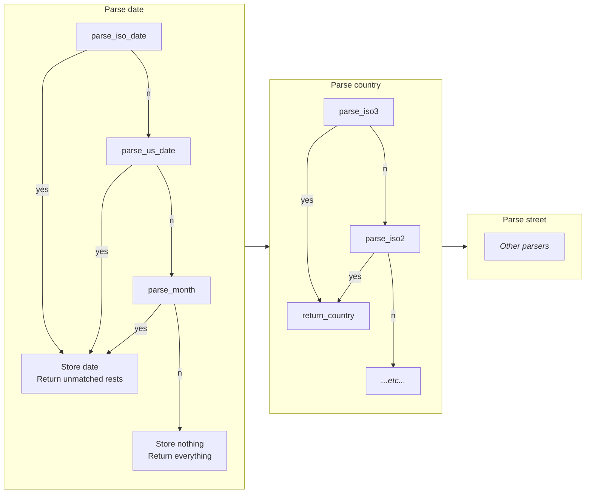

# FRIDAY: The Technical Assignment

This is the technical assignment for Friday insurance company.

You may find the task description here:
[link](https://gist.github.com/frank-kutzey-friday/76f9bf6b5b8901f7a88cab059fe606c9).

## Prerequisites

- Python 3.7+ 
- Poetry or pytest to run tests

## How to run

To run the interactive command-line application, execute:

```shell
python solution.py
```

Simply follow instructions to play around with the solution.

### Run tests

For development, the Poetry dependency manager is used. 
Running the tests is possible with:

```shell
poetry install && poetry run pytest
```

An alternative may be to use global pytest:

```shell
pytest
```

## Design decisions

- **Put everything into a single file.** While it may be better
  to separate parsing function from patterns,
  the amount of code is fairly small to keep it together.
  In this setup, both ways are good but if the code will grow in the future,
  patterns should go into their own module.
- **Using named groups in regex.**
  I decided to stick to the named capture groups because it makes
  the code a bit conciser.   
  Unfortunately, different programming languages have different
  implementations, and it should've been adjusted accordingly when porting,
  e.g. into Spark.
- **Using plain Python** because it is easier for this particular task
  (no additional infrastructure and maintenance) and no other requirements are provided.

## Other possible approaches

It is an easy task when there are only 2 things to extract.
What can make things more complicated is adding another element, e.g. country.
And another, region. And, let's say, date.

In this case, the number of permutations would grow bigger and bigger with each new
element type and eventually become impossible to maintain.

As a workaround, we could switch the implementation by:

- sticking to the most atomic elements and
- extracting them one by one, combining into a processing pipeline.

To illustrate this with picture:



In this case, we would need to maintain only simple regexpos.
The only place where they interfere would be a parsing order.
There, it makes sense to place more specific parsers before more general ones.

E.g. if data contains ISO dates, year-months, and just years,
we have to process them in this exact order to be as greedy as possible.

This approach should come up more robust for complex cases. 
